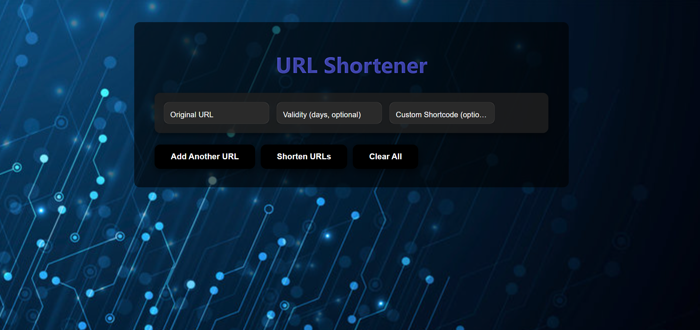

# URL Shortener

A **React + Vite** frontend application to shorten URLs, with optional validity periods and custom shortcodes. Designed with a sleek UI, gradient buttons, and smooth transitions for a professional user experience.

## 🚀 Features

- Shorten up to **5 URLs concurrently**.
- Optional **validity period** for each shortened URL.
- Optional **custom shortcode** for personalized links.
- Displays **original URL, shortened URL, shortcode, and expiry date**.
- **Clear All** button to reset inputs and results.
- Styled with **Material UI**, gradient buttons, and dark mode-friendly design.
- **Persistent storage** using localStorage.
- Fully responsive design.

## Screenshots
## Project Screenshot




- 


## 🛠️ Tech Stack

- **React** (Functional components & hooks)
- **Vite** (Fast build tool)
- **Material UI** (UI components)
- **localStorage** (Data persistence)
- **CSS3** (Custom styling with gradients and hover effects)
- **shrtco.de API** (URL shortening)

## ⚡ How to Run Locally

1. Clone the repository:

```bash


📄 License

---

If you want, I can also **create a shorter, GitHub-friendly version** with **badges, live demo link, and quick instructions** so it looks more professional on your repo page.  

Do you want me to do that?

git clone https://github.com/harshraja45/Url_Shortner.git
cd Url_Shortner
